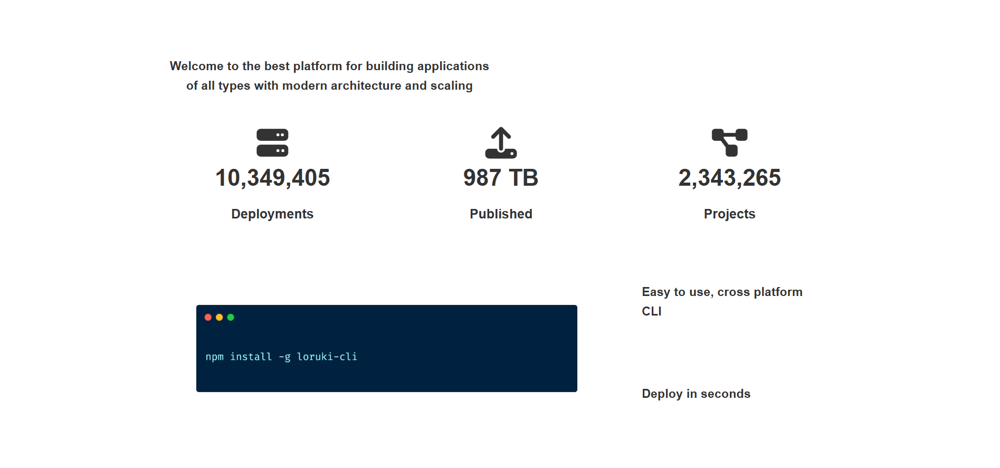
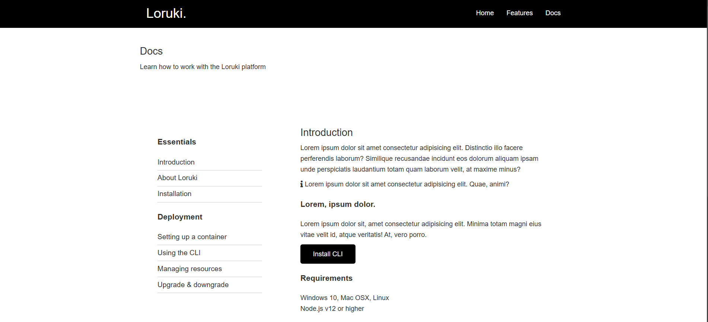
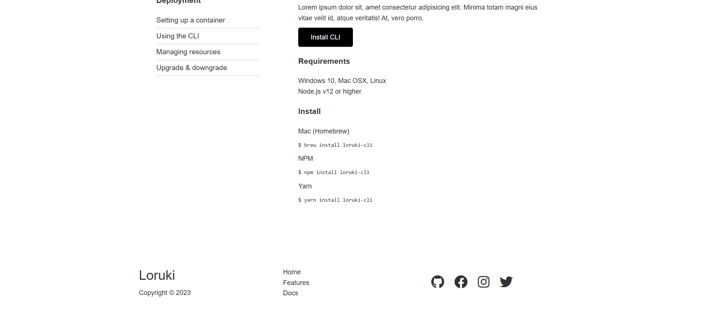
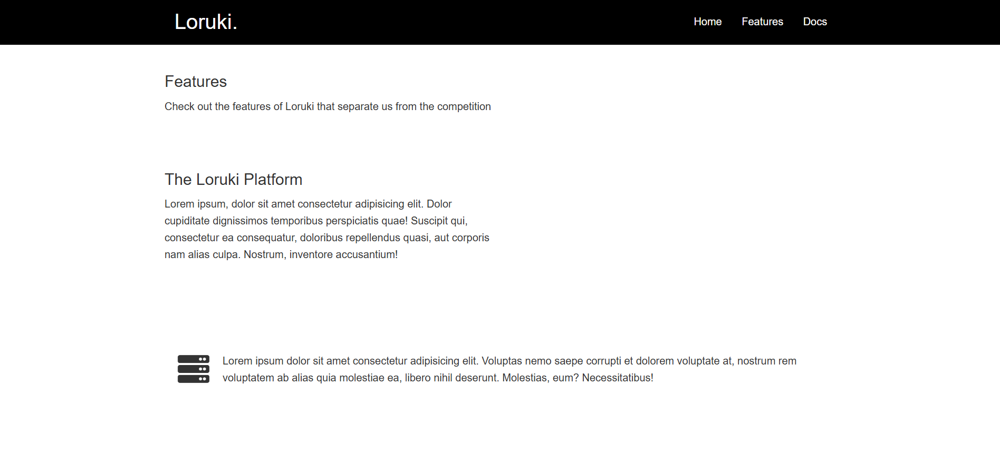
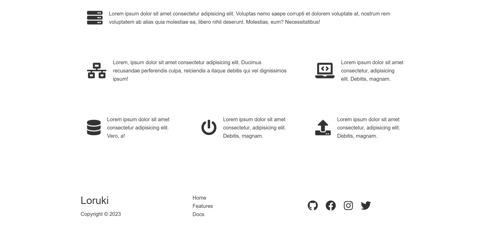

# 🌐 Loruki-Website – Modern HTML5 & CSS3 Web Design

Loruki-Website is a simple yet elegant HTML5 & CSS3 project designed to showcase a modern, responsive web layout. Built with a clean and structured design, it is perfect for learning and practicing front-end development fundamentals.

---

## 🚀 Features

- 🎨 **Modern UI Design** – A professional and minimalistic layout.
- 📱 **Fully Responsive** – Adapts to all screen sizes for a seamless user experience.
- ⚡ **Pure HTML & CSS** – No frameworks, just clean and well-organized code.
- 🔄 **Cross-Browser Compatibility** – Works across all major web browsers.
- 🎯 **Easy to Customize** – Simple structure for quick modifications.

---

## 🛠️ Tech Stack

- **HTML5** – Structuring the content.
- **CSS3** – Styling and responsive design.

---

## 📷 Screenshots

### Home Page Screenshots

| Home | Home 2 | Home 3 |
|------|--------|--------|
|  |  |  |

### Docs Page Screenshots

| Docs 1 | Docs 2 |
|--------|--------|
|  |  |

### Features Page Screenshots

| Features 1 | Features 2 |
|------------|------------|
|  |  |

---

## 🎯 How to Use

1. Clone the Repository
   ```bash
   git clone https://github.com/hadialkari/Loruki-Website.git
   cd Loruki-Website
   
2. **Open `index.html` in your browser**
   Simply open the file to view the website.

## 📜 License

This project is **open-source** 
